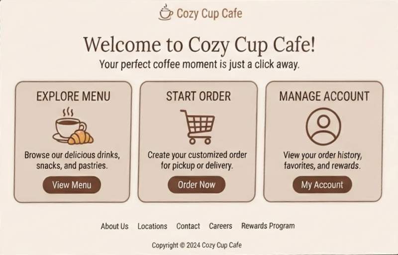
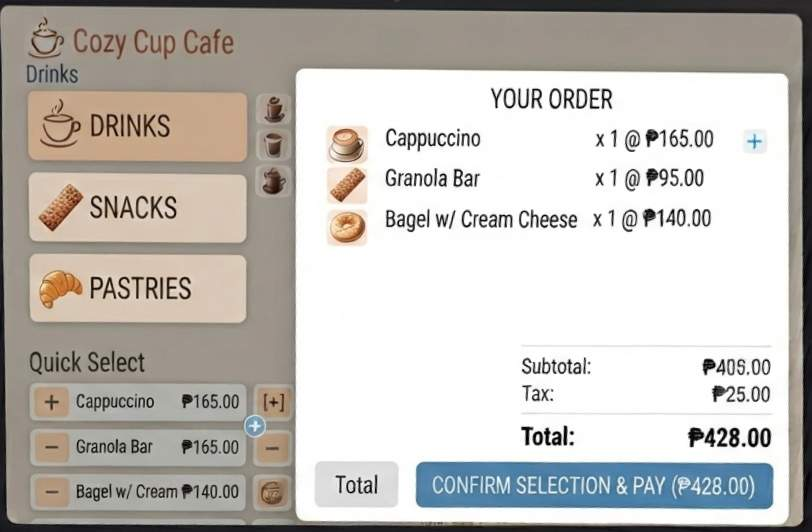
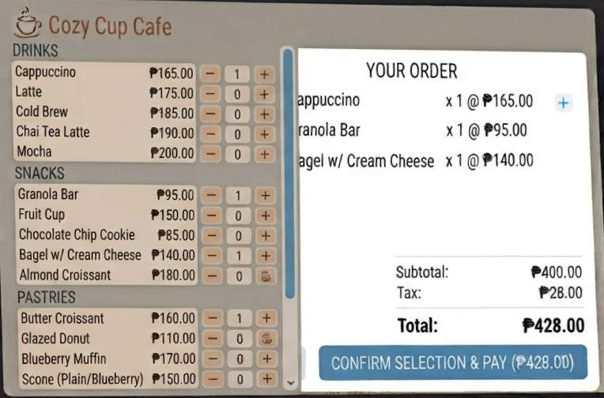
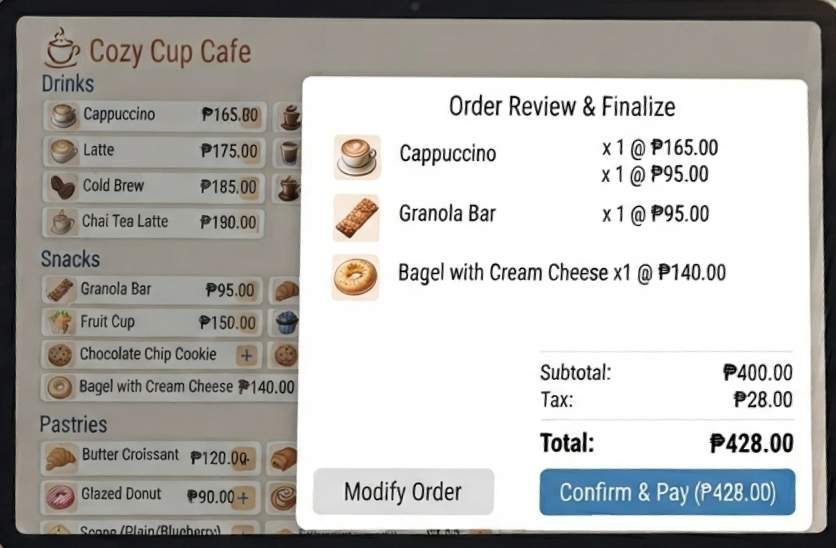

 <h1 align="center">Project Description 
 

##### 
Cozy Cup Cafe is a simple cafe management project designed to simulate a real coffee shop experience. It allows users to browse menu items, place orders, and view a clean and organized ordering system.

##

<h1 align="center">Features

###
+ ☕ Browse available food and drinks
+ 🛒 Add items to order
+ 💰 View total price automatically
+ 📦 Order summary display
+ 🖥️ Simple and user-friendly interface

##

<h1 align="center">Screen Captures

###

##

<h1 align="center">About the Authors

###

<b>Bendanillo, Irene C.

<b>202330198@psu.palawan.edu.ph

#

<b>Apilan, Mary Mae M.

<b>202280080@psu.palawan.edu.ph

